_Japanese translation from [the original post](http://jakearchibald.com/2014/offline-cookbook/) in English._

_原文: [The offline cookbook by Jake Archibald] (http://jakearchibald.com/2014/offline-cookbook/)_

> #The offline cookbook
> _Posted 09 December 2014_

#オフラインクックブック
_投稿日：2014年12月9日_

> When AppCache arrived on the scene it gave us a couple of patterns to make content work offline. If those were the patterns you needed, congratulations, you won the AppCache lottery (the jackpot remains unclaimed), but the rest of us were left huddled in a corner [rocking back & forth](http://alistapart.com/article/application-cache-is-a-douchebag).

最初に登場したのはアプリケーションキャッシュ（AppCache）でした。AppCacheはコンテンツをオフラインでアクセスするための２、３のパターンを提供します。もしそれらのパターンがあなたのニーズに一致していたとしたら、あなたはとてもラッキーです。なぜなら、それは宝くじに当たったも同然なのですから。（未だに当選者は現れていませんが。）一方、アンラッキーな残りの大多数である我々は、どうすればよいのか分からずにただ[右往左往](http://alistapart.com/article/application-cache-is-a-douchebag)するばかりです。

> With ServiceWorker ([intro](http://www.html5rocks.com/ja/tutorials/service-worker/introduction/)) we gave up trying to solve offline, and gave developers the moving parts to go solve it themselves. It gives you control over caching and how requests are handled. That means you get to create your own patterns. Let's take a look at a few possible patterns in isolation, but in practice you'll likely use many of them in tandem depending on URL & context.

そして[Service Worker](http://www.html5rocks.com/ja/tutorials/service-worker/introduction/)が登場しました。Service Workerは、オフライン機能そのものを提供するのではなく、アプリケーションの開発者が自身で問題を解決できるように、低レベルな部品を提供します。それにより、開発者はキャッシュやリクエスト処理をより細かくコントロールできるようになったのです。それはまた、開発者自身がデザインパターンを考えなければならないことを意味します。この記事では、考えられるパターンをひとつづつ取り上げて見ていきます。実際にはアプリケーションのURLやコンテキストに基づいて、複数のパターンを組み合わせて適用することになると思います。

> All code examples work today in [Chrome 40 beta](https://www.google.com/chrome/browser/beta.html) with the [cache polyfill](https://github.com/coonsta/cache-polyfill), unless otherwise noted. This stuff will land into the stable version January/February 2015 barring any emergencies, so it won't be long until millions of real users can benefit from this stuff.

記事中のすべてのサンプルコードは、特に言及しない限り [Chrome 40 beta](https://www.google.co.jp/chrome/browser/beta.html) と [Cache polyfill](https://github.com/coonsta/cache-polyfill)を使って動かすことができます。このバージョンのChromeは2015年の１月か２月頃に正式版としてリリースされる予定ですので、この記事で紹介する機能が実際のフィールドで動作可能になるのはそれほど先の話ではありません。（※訳注：Chrome 40 は2015年１月に正式版として無事リリースされました。）

> For a working demo of some of these patterns, see [Trained-to-thrill](https://jakearchibald.github.io/trained-to-thrill/), and [this video](https://www.youtube.com/watch?v=px-J9Ghvcx4) showing the performance impact.

また、本記事で紹介するいくつかのパターンを実際に適用したアプリケーション[Trained-to-thrill](https://jakearchibald.github.io/trained-to-thrill/)と、そのパフォーマンスの改善結果がわかる[動画](https://www.youtube.com/watch?v=px-J9Ghvcx4)も参照ください。

> **Contents**

> 1. The cache machine - when to store resources
>  1. On install - as a dependency
>  2. On install - not as a dependency
>  3. On activate
>  4. On user interaction
>  5. On network response
>  6. Stale-while-revalidate
>  7. On push message
>  8. On background-sync
> 2. Cache persistence
> 3. Serving suggestions - responding to requests
>  1. Cache only
>  2. Network only
>  3. Cache, falling back to network
>  4. Cache & network race
>  5. Network falling back to cache
>  6. Cache then network
>  7. Generic fallback
>  8. ServiceWorker-side templating
> 4. Putting it together

**目次**

1. [キャッシュ更新の８つのパターン](#the-cache-machine-when-to-store-resources)
 1. [パターン１：`install`イベント時に依存リソースをキャッシュに保存する](#on-install-as-a-dependency)
 2. [パターン２：`install`イベント時に非依存リソースをキャッシュに保存する](#on-install-not-as-a-dependency)
 3. [パターン３：`activate`イベント時に不要なリソースをキャッシュから削除する](#on-activate)
 4. [パターン４：ユーザーの操作によりリソースをキャッシュに保存する](#on-user-interaction)
 5. [パターン５：`fetch`イベント時にレスポンスをキャッシュに保存する](#on-network-response)
 6. [パターン６：`stale-while-revalidate`パターン](#stale-while-revalidate)
 7. [パターン７：Push通知](#on-push-message)
 8. [パターン８：バックグラウンド同期](#on-background-sync)
2. [キャッシュの持続性](#cache-persistence)
3. [リクエスト処理の８つのパターン](#serving-suggestions-responding-to-requests)
 1. [パターン１：常にキャッシュから取得する](#cache-only)
 2. [パターン２：常にネットワークから取得する](#network-only)
 3. [パターン３：キャッシュになければネットワークから取得する](#cache-falling-back-to-network)
 4. [パターン４：キャッシュとネットワークのどちらか速い方から取得する](#cache-network-race)
 5. [パターン５：ネットワークから取得できなければキャッシュから取得する](#network-falling-back-to-cache)
 6. [パターン６：キャッシュから取得してさらにネットワークからも取得する](#cache-then-network)
 7. [パターン７：キャッシュからもネットワークからも取得できなかった場合にデフォルトコンテンツを表示する](#generic-fallback)
 8. [パターン８：Service Workerサイド・テンプレート](#serviceworker-side-templating)
4. [まとめ](#putting-it-together)

> ##The cache machine - when to store resources

##<a name="the-cache-machine-when-to-store-resources"></a>キャッシュ更新の８つのパターン

> ServiceWorker lets you handle requests independently from caching, so we'll look at them separately. First up, caching, when should it be done?

Service Workerでは、リクエストとキャッシュは独立したものとして扱われます。本記事でもそれらを分けて説明します。まずはキャッシュに関して、どのタイミングでキャッシュを更新するかという点に着目し、考えられる８つのパターンを挙げます。

> ###On install - as a dependency

###<a name="on-install-as-a-dependency"></a>パターン１：`install`イベント時に依存リソースをキャッシュに保存する

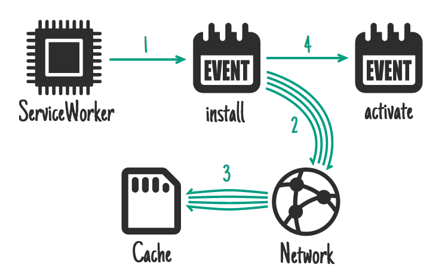

> ServiceWorker gives you an install event. You can use this to get stuff ready, stuff that must be ready before you handle other events. While this happens any previous version of your ServiceWorker is still running & serving pages, so the things you do here mustn't disrupt that.

Service Worker は`install`イベントを受け取ります。`install`イベントでは、他のイベントを処理する前にやっておくべき準備を行います。ここで注意しないといけないことは、Service Wrokerが更新されたとき、`install`イベントの時点では、まだ古いService Workerによりページが提供されているということです。つまり、`install`イベントで行う処理が、現在のページの動作に影響を与えないように注意する必要があります。

> **Ideal for:** CSS, images, fonts, JS, templates… basically anything you'd consider static to that "version" of your site.

**このパターンが適するのは：**アプリケーションの特定のバージョンを構成するCSS、画像、フォント、JavaScript、テンプレート等、基本的にすべての静的なリソース。

> These are things that would make your site entirely non-functional if they failed to fetch, things an equivalent native-app would make part of the initial download.

これらのリソースはアプリケーションにとって必要不可欠なものであり、ネイティブアプリのインストーラに含まれるファイルと同等です。

```js
self.addEventListener('install', function(event) {
  event.waitUntil(
    caches.open('mysite-static-v3').then(function(cache) {
      return cache.addAll([
        '/css/whatever-v3.css',
        '/css/imgs/sprites-v6.png',
        '/css/fonts/whatever-v8.woff',
        '/js/all-min-v4.js'
        // etc
      ]);
    })
  );
});
```

> `event.waitUntil` takes a promise to define the length & success of the install. If the promise rejects, the installation is considered a failure and this ServiceWorker will be abandoned (if an older version is running, it'll be left intact). `caches.open` and `cache.addAll` return promises. If any of the resources fail to fetch, the `cache.addAll` call rejects.

`event.waitUntil`はPromiseオブジェクトを受け取ります。このPromiseオブジェクトではインストールの一連の処理が定義されます。もしPromiseがrejectされた場合、インストールは失敗し、Service Workerはインストールされません。（古いバージョンのService Workerがあれば、それは影響を受けません。）`cache.open`と`cache.addAll`はどちらもPromiseオブジェクトを返します。ここで取得するリソースのうち、ひとつでも取得に失敗すれば、`cache.addAll`の呼び出しはrejectされます。

> On [trained-to-thrill](https://jakearchibald.github.io/trained-to-thrill/) I use this to [cache static assets](https://github.com/jakearchibald/trained-to-thrill/blob/3291dd40923346e3cc9c83ae527004d502e0464f/www/static/js-unmin/sw/index.js#L3).

サンプルアプリケーションの[trained-to-thrill](https://jakearchibald.github.io/trained-to-thrill/)では、すべての静的なアセットを`install`イベントで[キャッシュに保存しています](https://github.com/jakearchibald/trained-to-thrill/blob/3291dd40923346e3cc9c83ae527004d502e0464f/www/static/js-unmin/sw/index.js#L3)。

> ###On install - not as a dependency

###<a name="on-install-not-as-a-dependency"></a>パターン２：`install`イベント時に非依存リソースをキャッシュに保存する

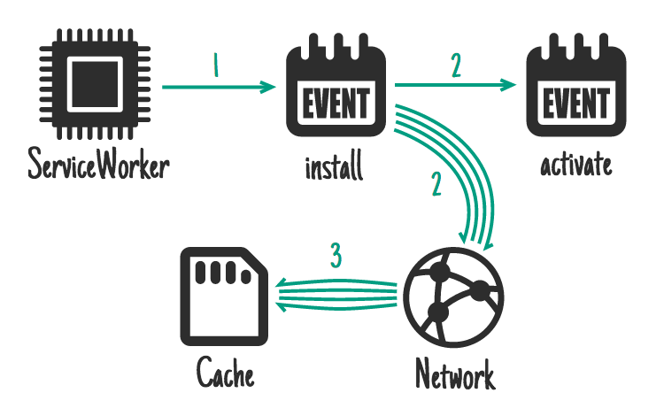

> Similar to above, but won't delay install completing and won't cause installation to fail if caching fails.

パターン１に似ていますが、インストール完了まで待たず、またキャッシュ保存が失敗してもインストール自体は失敗しない点が異なります。

> **Ideal for:** Bigger resources that aren't needed straight away, such as assets for later levels of a game.

**このパターンが適するのは：**サイズが大きく、直接アプリケーションの動作に必要ないリソース。例えば、ゲームの後半のレベルで使用されるアセット等。

```js
self.addEventListener('install', function(event) {
  event.waitUntil(
    caches.open('mygame-core-v1').then(function(cache) {
      cache.addAll(
        // levels 11-100
      );
      return cache.addAll(
        // core assets & levels 1-10
      );
    })
  );
});
```

> We're not passing the `cache.addAll` promise for levels 11-100 back to `event.waitUntil`, so even if it fails, the game will still be available offline. Of course, you'll have to cater for the possible absence of those levels & reattempt caching them if they're missing.

ここでは`cache.addAll`を２回呼び出していますが、前者の"levels 11-100"の方は戻り値のPromiseオブジェクトを`event.waitUntil`に渡していません。これにより、もし"levels 11-100"のデータが取得できなくても、Service Workerはインストールされ、アプリケーションはオフラインで動作します。もちろん、アプリケーションはそれらのデータが取得できなかった場合を想定した作りになっている必要があります。

> Also, the ServiceWorker may be killed while levels 11-100 download since it's finished handling events, but the download will continue in the background.

また、"levels 11-100"のデータ取得中にService Workerが強制終了する場合もあります。これは"levels 11-100"以外のデータをキャッシュに保存した時点でイベント処理は完了したとみなされるからです。この場合、Service Workerが終了しても"levels 11-100"のダウンロードはバックグラウンドで継続します。

> ###On activate

###<a name="on-activate"></a>パターン３：`activate`イベント時に不要なリソースをキャッシュから削除する


> **Ideal for:** Clean-up & migration.

**このパターンが適するのは：**キャッシュの後片付け、およびIndexedDBのスキーマのマイグレーション。

> Once a new ServiceWorker has installed & a previous version isn't being used, the new one activates, and you get an activate event. Because the old version is out of the way, it's a good time to handle schema migrations in IndexedDB and also delete unused caches.

ひとたびService Workerがインストールされて、古いバージョンのService Workerにより提供されていたページが閉じられると、新しいバージョンに対して`activate`イベントが発行されます。古いバージョンはもう使用されることはないため、ここで不要なキャッシュの削除や、IndexedDBのスキーマのマイグレーション処理を行います。

```js
self.addEventListener('activate', function(event) {
  event.waitUntil(
    caches.keys().then(function(cacheNames) {
      return Promise.all(
        cacheNames.filter(function(cacheName) {
          // > Return true if you want to remove this cache,
          // > but remember that caches are shared across
          // > the whole origin
          // キャッシュから削除したい場合trueを返します。
          // キャッシュはすべてのオリジンで共有されている
          // ことに注意してください。
        }).map(function(cacheName) {
          return caches.delete(cacheName);
        })
      );
    })
  );
});
```

> During activation, other events such as `fetch` are put into a queue, so a long activation could potentially block page loads. Keep your activation as lean as possible, only use it for things you _couldn't_ do while the old version was active.

`activate`イベントを処理している間、他のイベント（`fetch`イベント等）は待たされることになります。つまり、`activate`イベントの処理が長引くと、ページのロードがブロックされる可能性があります。`activate`で行う処理はなるべく手短に済ませるようにし、古いバージョンのService Workerが動作しているときには実行できなかった処理のみをここで行ってください。

> On [trained-to-thrill](https://jakearchibald.github.io/trained-to-thrill/) I use this to [remove old caches](https://github.com/jakearchibald/trained-to-thrill/blob/3291dd40923346e3cc9c83ae527004d502e0464f/www/static/js-unmin/sw/index.js#L17).

サンプルアプリケーションの[trained-to-thrill](https://jakearchibald.github.io/trained-to-thrill/)では、不要となったリソースを`activate`イベントで[キャッシュから削除しています](https://github.com/jakearchibald/trained-to-thrill/blob/3291dd40923346e3cc9c83ae527004d502e0464f/www/static/js-unmin/sw/index.js#L17)。

> ###On user interaction

###<a name="on-user-interaction"></a>ユーザーの操作によりリソースをキャッシュに保存する


> **Ideal for:** If the whole site can't be taken offline, you may allow the user to select the content they want available offline. E.g. a video on something like YouTube, an article on Wikipedia, a particular gallery on Flickr.

**このパターンが適するのは：**アプリケーション全体をオフラインで利用可能にするのが現実的でない場合、オフラインで利用したいコンテンツをユーザーに選択させる。例えば、YouTubeの動画、Wikipediaの記事、Flickrのギャラリー等において、特定なコンテンツのみをキャッシュに保存する。

> Give the user a "Read later" or "Save for offline" button. When it's clicked, fetch what you need from the network & pop it in the cache.

このパターンでは、ユーザーに「後で読む」ボタンや「オフライン視聴向けに保存」ボタン等のUIを提供して、それらが押されたタイミングで、ネットワークからリソースを読み込み、キャッシュに保存します。

```js
document.querySelector('.cache-article').addEventListener('click', function(event) {
  event.preventDefault();

  var id = this.dataset.articleId;
  caches.open('mysite-article-' + id).then(function(cache) {
    fetch('/get-article-urls?id=' + id).then(function(response) {
      // > /get-article-urls returns a JSON-encoded array of
      // > resource URLs that a given article depends on
      // /get=article-urlsは、指定した記事が依存するすべての
      // リソースのURLを含む配列をJSONの形式で返します。
      return response.json();
    }).then(function(urls) {
      cache.addAll(urls);
    });
  });
});
```

> The above doesn't work in Chrome yet, as we've yet to expose fetch and caches to pages ([ticket #1](https://code.google.com/p/chromium/issues/detail?id=436770), [ticket #2](https://code.google.com/p/chromium/issues/detail?id=439389)). You could use navigator.serviceWorker.controller.postMessage to [send a signal to the ServiceWorker](https://github.com/GoogleChrome/samples/tree/gh-pages/service-worker/post-message) telling it which article to cache, and handle the rest there.

`fetch`と`cache`はChromeでまだ実装されていないため、上記のコードは動きません。関連するチケットは、[ticket #1](https://code.google.com/p/chromium/issues/detail?id=436770)および[ticket #2](https://code.google.com/p/chromium/issues/detail?id=439389)です。その代わり、`navigator.serviceWorker.controller.postMessage`を使って[Service Workerにメッセージを送ることが可能です](https://github.com/GoogleChrome/samples/tree/gh-pages/service-worker/post-message)。（※訳注：[`fetch` API](http://updates.html5rocks.com/2015/03/introduction-to-fetch)は Chrome 42で実装されました。）

> ###On network response

###<a name="on-network-response"></a>パターン５：`fetch`イベント時にレスポンスをキャッシュに保存する


> **Ideal for:** Frequently updating resources such as a user's inbox, or article contents. Also useful for non-essential content such as avatars, but care is needed.

**このパターンが適するのは：**頻繁に更新されるリソース（例：メールの受信箱やブログ記事）、もしくはアプリケーションに必須ではないコンテンツ（例：アバター等）。ただし注意が必要。（後述）

> If a request doesn't match anything in the cache, get it from the network, send it to the page & add it to the cache at the same time.

このパターンでは、リクエストを処理する際に、キャッシュに見つからなければネットワークから取得し、レスポンスをページに表示するとともにキャッシュにも保存します。

> If you do this for a range of URLs, such as avatars, you'll need to be careful you don't bloat the storage of your origin — if the user needs to reclaim disk space you don't want to be the prime candidate. Make sure you get rid of items in the cache you don't need any more.

しかしながら、このパターンをアバターのような広範囲なURLに対して適用するには注意が必要です。キャッシュに必要な記憶容量が増加するため、ユーザーがディスクスペースを整理する際に、あなたのアプリケーションは真っ先に削除候補に挙がるでしょう。それを避けるには、不要なキャッシュをこまめに削除しなければいけません。

```js
self.addEventListener('fetch', function(event) {
  event.respondWith(
    caches.open('mysite-dynamic').then(function(cache) {
      return cache.match(event.request).then(function (response) {
        return response || fetch(event.request.clone()).then(function(response) {
          cache.put(event.request, response.clone());
          return response;
        });
      });
    })
  );
});
```

> To allow for efficient memory usage, you can only read a response/request's body once. In the code above, [`.clone()`](https://fetch.spec.whatwg.org/#dom-request-clone) is used to create additional copies that can be read separately.

ここで注意してほしいことは、メモリー使用の最適化のため、`request`および`response`オブジェクトの内容は一回しか読み出せないようになっていることです。上記のコードでは、[`.clone()`](https://fetch.spec.whatwg.org/#dom-request-clone)メソッドを使用することでオブジェクトをコピーして、重複して内容を読み出せるようにしています。

> On [trained-to-thrill](https://jakearchibald.github.io/trained-to-thrill/) I use this to [cache Flickr images](https://github.com/jakearchibald/trained-to-thrill/blob/3291dd40923346e3cc9c83ae527004d502e0464f/www/static/js-unmin/sw/index.js#L109).

サンプルアプリケーションの[trained-to-thrill](https://jakearchibald.github.io/trained-to-thrill/)では、[Flickrの画像をキャッシュに保存](https://github.com/jakearchibald/trained-to-thrill/blob/3291dd40923346e3cc9c83ae527004d502e0464f/www/static/js-unmin/sw/index.js#L109)しています。

> ###Stale-while-revalidate

###<a name="stale-while-revalidate"></a>パターン６：`stale-while-revalidate`パターン

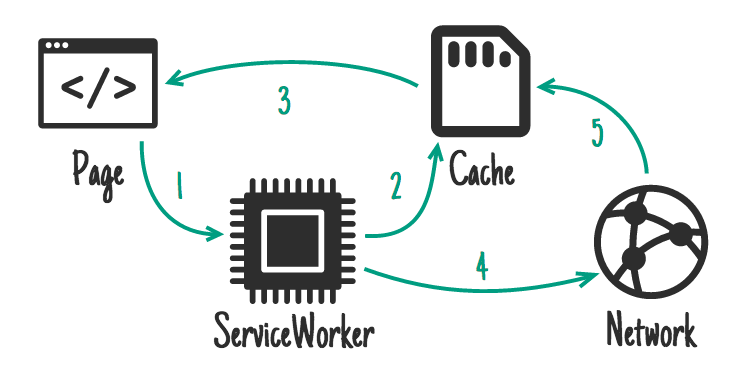

> **Ideal for:** Frequently updating resources where having the very latest version is non-essential. Avatars can fall into this category.

**このパターンが適するのは：**頻繁に更新されるが、必ずしも最新のバージョンである必要がないリソース。アバターはこれに該当する。

> If there's a cached version available, use it, but fetch an update for next time.

このパターンでは、リクエストされたリソースがキャッシュに見つかった場合は、それを使用すると同時に、次回のリクエストに備えてネットワークからも取得しておきます。

```js
self.addEventListener('fetch', function(event) {
  event.respondWith(
    caches.open('mysite-dynamic').then(function(cache) {
      return cache.match(event.request).then(function(response) {
        var fetchPromise = fetch(event.request.clone()).then(function(networkResponse) {
          cache.put(event.request, networkResponse.clone());
          return networkResponse;
        })
        return response || fetchPromise;
      })
    })
  );
});
```

> This is very similar to HTTP's [stale-while-revalidate](https://www.mnot.net/blog/2007/12/12/stale).

このパターンはHTTPの[stale-while-revalidate](https://www.mnot.net/blog/2007/12/12/stale)とよく似ています。

> ###On push message

###<a name="on-push-message"></a>パターン７：Push通知

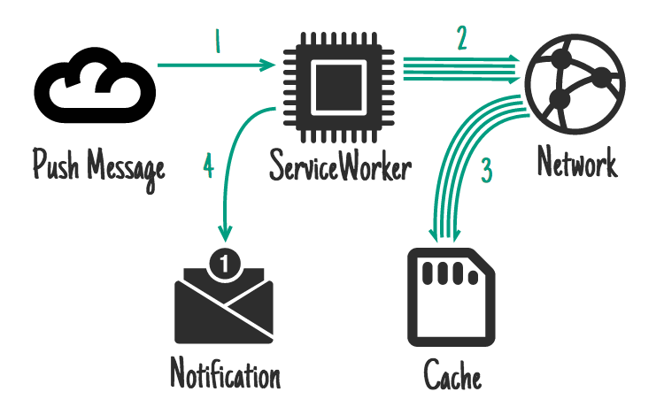

> **Note:** Push isn't supported in Chrome yet.

**Note:** Push通知はChromeではまだサポートされていません。（※訳注：Chrome 42で[サポートされました](http://updates.html5rocks.com/2015/03/push-notificatons-on-the-open-web)。）

> The [Push API](https://w3c.github.io/push-api/) is another feature built on top of SerivceWorker. This allows the ServiceWorker to be awoken in response to a message from the OS's messaging service. This happens even when the user doesn't have a tab open to your site, only the ServiceWorker is woken up. You request permission to do this from a page & the user will be prompted.

[Push API](https://w3c.github.io/push-api/)は、Service Workerを利用して実現される新たな機能です。これにより、OSのメッセージングサービス経由でService Workerを起動することが可能になります。このときユーザーがアプリケーションのページをブラウザのタブで開いていなかったとしても、バックグラウンドでService Workerが起動されます。アプリケーションはPush通知を受けることをあらかじめユーザーに伝えて許可を得る必要があります。

> **Ideal for:** Content relating to a notification, such as a chat message, a breaking news story, or an email. Also infrequently changing content that benefits from immediate sync, such as a todo list update or a calendar alteration.

**このパターンが適するのは：**通知が必要なコンテンツ、例えばチャットのメッセージや、ニュース速報、新着メール等。また、頻繁に更新されるわけではないが即座に同期することに意味があるコンテンツ、例えばTODOリストやカレンダーアプリ等。

> The common final outcome is a notification which, when tapped, opens/focuses a relevant page, but updating caches before this happens is extremely important. The user is obviously online at the time of receiving the push message, but they may not be when they finally interact with the notification, so making this content available offline is important. The Twitter native app, which is for the most part an excellent example of offline-first, gets this a bit wrong:

通常はPush通知をタップすることで関連するページが開かれますが、ユーザーがタップする前にあらかじめキャッシュを更新しておくことは非常に重要です。Push通知を受け取ったときはユーザーは当然オンラインなのですが、Push通知をタップするときは必ずしもオンラインであるとは限りません。従って、Push通知をタップして開くコンテンツはオフラインで利用可能でなければいけません。Twitterのネイテイィブアプリはオフラインファーストのすばらしい見本ですが、Push通知のこの要件を満たしていません。

<a href="http://www.youtube.com/watch?feature=player_embedded&v=0i7YdSEQI1w" target="_blank"></a>

> Without a connection, Twitter fails to provide the content relating to the push message. Tapping it does remove the notification however, leaving the user with less information than before they tapped. Don't do this!

ネットワークに繋がっていない状態だと、TwitterはPush通知のコンテンツを表示できません。しかも、タップすることでPush通知は削除されてしまいます。これではPush通知をタップしたことでユーザーは情報を失ったことになります。このようなUIにならないよう気をつけてください。

> This code updates caches before showing a notification:

以下のコードはPush通知を表示する前にコンテンツをキャッシュに保存しています。

```js
self.addEventListener('push', function(event) {
  if (event.data.text() == 'new-email') {
    event.waitUntil(
      caches.open('mysite-dynamic').then(function(cache) {
        return fetch('/inbox.json').then(function(response) {
          cache.put('/inbox.json', response.clone());
          return response.json();
        });
      }).then(function(emails) {
        registration.showNotification("New email", {
          body: "From " + emails[0].from.name
          tag: "new-email"
        });
      })
    );
  }
});

self.addEventListener('notificationclick', function(event) {
  if (event.notification.tag == 'new-email') {
    // > Assume that all of the resources needed to render
    // > /inbox/ have previously been cached, e.g. as part
    // > of the install handler.
    // この時点で/inbox/のコンテンツを表示するために必要なリソース
    // はすべてキャッシュされていなければいけない。
    new WindowClient('/inbox/');
  }
});
```

> ###On background-sync

###<a name="on-background-sync"></a>パターン８：バックグラウンド同期


> **Note:** Background sync isn't supported in Chrome yet.

**Note:** バックグラウンド同期はChromeではまだサポートされていません。

> [Background sync](https://github.com/slightlyoff/BackgroundSync/blob/master/explainer.md) is another feature built on top of ServiceWorker. It allows you to request background data synchronisation as a one-off, or on an (extremely heuristic) interval. This happens even when the user doesn't have a tab open to your site, only the ServiceWorker is woken up. You request permission to do this from a page & the user will be prompted.

[バックグラウンド同期](https://github.com/slightlyoff/BackgroundSync/blob/master/explainer.md)もまた、Service Workerを利用して実現される新たな機能です。これにより、アプリケーションはバックグラウンドでデータを同期することが可能になります。バックグラウンド同期は一回限り、もしくは非常に長い周期で実施されます。このときユーザーがアプリケーションのページをブラウザのタブで開いていなかったとしても、バックグラウンドでService Workerが起動されます。アプリケーションはバックグラウンド同期を実施することをあらかじめユーザーに伝えて許可を得る必要があります。

> **Ideal for:** Non-urgent updates, especially those that happen so regularly that a push message per update would be too frequent, such as social timelines or news articles.

**このパターンが適するのは：**同期の緊急度が高くないコンテンツ。特に、ソーシャルメディアのタイムラインやニュースの記事等、更新のたびにPush通知を送るまでもないコンテンツ。

```js
self.addEventListener('sync', function(event) {
  if (event.id == 'update-leaderboard') {
    event.waitUntil(
      caches.open('mygame-dynamic').then(function(cache) {
        return cache.add('/leaderboard.json');
      })
    );
  }
});
```

> ##Cache persistence

##<a name="cache-persistence"></a>キャッシュの持続性

> Your origin is given a certain amount of free space to do what it wants with. That free space is shared between all origin storage: LocalStorage, IndexedDB, Filesystem, and of course Caches.

あるサイズの不揮発領域がアプリケーションのオリジンごとに割り当てられます。ここで不揮発領域と言っているのは、LocalStorage、IndexedDB、Filesystem、キャッシュ等をあわせたものですが、これらは他のオリジンと共用されます。

> The amount you get isn't spec'd, it will differ depending on device and storage conditions. You can find out how much you've got via:

利用可能な不揮発領域の具体的なサイズは仕様で定義されておらず、デバイスや状況によって変わりますが、アプリケーションは以下のようにして利用可能なサイズを確認できます。

```js
navigator.storageQuota.queryInfo("temporary").then(function(info) {
  console.log(info.quota);
  // Result: <quota in bytes>
  console.log(info.usage);
  // Result: <used data in bytes>
});
```

> However, like all browser storage, the browser is free to throw it away if the device becomes under storage pressure. Unfortunately the browser can't tell the different between those movies you want to keep at all costs, and the game you don't really care about.

しかし、デバイスの記憶容量が不足した場合、それらの不揮発領域はブラウザにより強制的に解放されます。「この動画はどうしても残したいけれど、このゲームは削除されてもかまわない」といった違いをブラウザに伝える方法は残念ながらありません。

> To work around this, there's a proposed API, [Storage Durability](https://github.com/slightlyoff/StorageDurability/blob/master/explainer.md):

こういった問題に対処すべく、[Storage Durability](https://github.com/slightlyoff/StorageDurability/blob/master/explainer.md) APIが提案されました。このAPIは、不揮発領域を永続的（durable）なものとして扱うようにブラウザにリクエストするためのAPIです。

```js
// > From a page:
// Webページのコード：
navigator.requestStorageDurability().then(function() {
  // > Hurrah, your data is here to stay!
  // 万歳！これでこのオリジンのデータは強制的に解放されなくなりました。
})
```

> Of course, the user has to grant permission. Making the user part of this flow is important, as we can now expect them to be in control of deletion. If their device comes under storage pressure, and clearing non-essential data doesn't solve it, the user gets to make a judgement call on which items to keep and remove.

もちろん、データを永続的にするためにはユーザーの許可を得る必要があります。そうすることで、永続的なデータを削除しなければいけなくなったときに、ユーザにどのリソースを削除するか判断を委ねることができるからです。デバイスの記憶容量が不足した場合、ブラウザは永続的でないデータを削除して、それでも足りない場合、どのリソースを削除してどれを残すか、ユーザーに問い合わせます。

> For this to work, it requires operating systems to treat "durable" origins as equivalent to native apps in their breakdowns of storage usage, rather than reporting the browser as a single item.

「永続的(durable)」と指定されたデータは、内部的にはオペレーティングシステムにより、ネイティブアプリと同等の記憶領域に分類されます。それにより、従来のブラウザ全体で単一とする分類とは違い、オリジンごとにデータの管理が可能になります。

> ##Serving suggestions - responding to requests

##<a name="serving-suggestions-responding-to-requests"></a>リクエスト処理の８つのパターン

> It doesn't matter how much caching you do, the ServiceWorker won't use the cache unless you tell it when & how. Here are a few patterns for handling requests:

どれだけキャッシュに保存しても、それらのキャッシュをいつ／どのように読み出すか、Service Workerに伝えてやらなければ使われないままです。ここではリクエスト処理に関して、考えられる８つのパターンを挙げます。

> ###Cache only

###<a name="cache-only"></a>パターン１：常にキャッシュから取得する

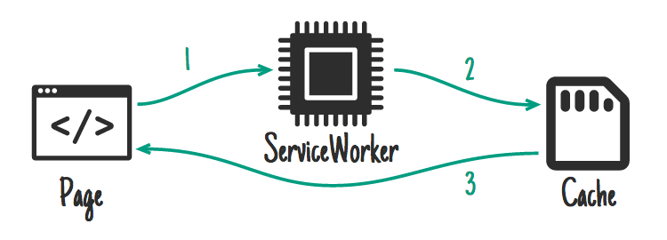

> **Ideal for:** Anything you'd consider static to that "version" of your site. You should have cached these in the install event, so you can depend on them being there.

**このパターンが適するのは：**アプリケーションの特定のバージョンを構成するすべての静的なリソース。これらのリソースは`install`イベント時に依存リソースとしてキャッシュに保存することで、必ずキャッシュに存在することが保証されています。

```js
self.addEventListener('fetch', function(event) {
  // > If a match isn't found in the cache, the response
  // > will look like a connection error
  // キャッシュに見つからなかった場合は、
  // コネクションエラーと同様のレスポンスになります
  event.respondWith(caches.match(event.request));
});
```

> …although you don't often need to handle this case specifically, ["Cache, falling back to network"](#cache-falling-back-to-network) covers it.

通常はこのパターンではなく、後述の[「キャッシュになければネットワークから取得する」](#cache-falling-back-to-network)が適用されます。

> ###Network only

###<a name="network-only"></a>パターン２：常にネットワークから取得する

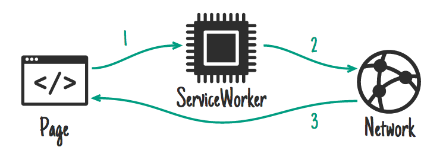

> **Ideal for:** Things that have no offline equivalent, such as analytics pings, non-GET requests.

**このパターンが適するのは：**オフラインでは成立しないリクエスト（例：アナリティクス APIの呼び出し、GET以外のHTTPリクエスト等）

```js
self.addEventListener('fetch', function(event) {
  event.respondWith(fetch(event.request));
  // > or simply don't call event.respondWith, which
  // > will result in default browser behaviour
  // もしくは単にevent.respondWithを呼びださなければ
  // ブラウザのデフォルトの動作（ネットワークから取得）となります。
});
```

> …although you don't often need to handle this case specifically, ["Cache, falling back to network"](#cache-falling-back-to-network) covers it.

通常はこのパターンではなく、後述の[「キャッシュになければネットワークから取得する」](#cache-falling-back-to-network)が適用されます。

> ###Cache, falling back to network

###<a name="cache-falling-back-to-network"></a>パターン３：キャッシュになければネットワークから取得する

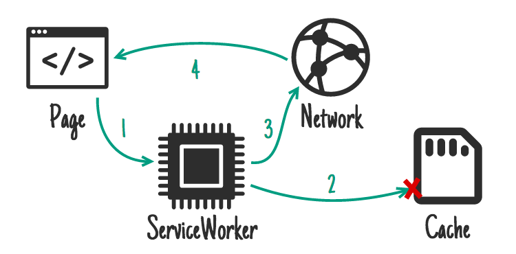

**Ideal for:** If you're building offline-first, this is how you'll handle the majority of requests. Other patterns will be exceptions based on the incoming request.

**このパターンが適するのは：**通常のオフラインファーストなアプリケーションでは、ほとんどのリクエスト処理にこのパターンが適用されます。そして、リクエストによっては例外的に他のパターンを適用します。

```js
self.addEventListener('fetch', function(event) {
  event.respondWith(
    caches.match(event.request).then(function(response) {
      return response || fetch(event.request);
    })
  );
});
```

> This gives you the "Cache only" behaviour for things in the cache and the "Network only" behaviour for anything not-cached (which includes all non-GET requests, as they cannot be cached).

このパターンはまず「常にキャッシュから取得する」のパターンを適用し、キャッシュに見つからない場合のみ「常にネットワークから取得する」のパターンを適用します。GET以外のHTTPリクエストはキャッシュに保存されないため、後者のパターンが適用されます。

> ###Cache & network race

###<a name="cache-network-race"></a>パターン４：キャッシュとネットワークのどちらか速い方から取得する

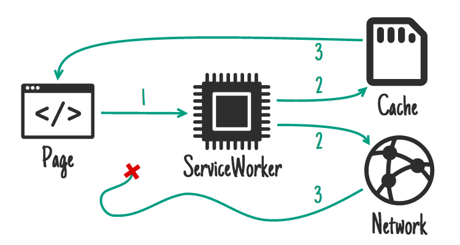

> **Ideal for:** Small assets where you're chasing performance on devices with slow disk access.

**このパターンが適するのは：**ディスクアクセスが低速なデバイスでサイズの小さいリソースをリクエストする場合。

> With some combinations of older hard drives, virus scanners, and faster internet connections, getting resources from the network can be quicker than going to disk. However, going to the network when the user has the content on their device can be a waste of data, so bear that in mind.

ある特定の環境では、ネットワークからリソースを取得する方がディスクから取得するよりも速い場合があります。これは、古いHDD、ウィルススキャン、速いインターネット接続等の、いずれかの条件もしくはそれらの組み合わせにより生じます。しかしながら、基本的にデバイス上に存在するデータをネットワークから取得するのであれば、データを無駄に持っていることになります。

```js
// > Promise.race is no good to us because it rejects if
// > a promise rejects before fulfilling. Let's make a proper
// > race function:
// Promise.race はいずれかのアイテムが成功するよりも先に
// あるアイテムが失敗した時点でrejectされてしまうので、
// ここでの要件（どのアイテムが最初に成功したか知りたい）を満たしません。
// 以下に独自のrace関数を実装しました。
function properRace(promises) {
  // we implement by inverting Promise.all
  Promise.all(
    promises.map(function(promise) {
      // for each promise, cast it, then swap around rejection & fulfill
      return Promise.resolve(promise).then(function(val) {
        throw val;
      }, function(err) {
        return err;
      });
    })
  ).then(function(errs) { // then swap it back
    throw Error("Proper race: none fulfilled");
  }, function(val) {
    return val;
  });
}

self.addEventListener('fetch', function(event) {
  event.respondWith(
    properRace([
      caches.match(event.request),
      fetch(event.request)
    ])
  );
});
```

> ###Network falling back to cache

###<a name="network-falling-back-to-cache"></a>パターン５：ネットワークから取得できなければキャッシュから取得する


> **Ideal for:** A quick-fix for resources that update frequently, outside of the "version" of the site. E.g. articles, avatars, social media timelines, game leader boards.

**このパターンが適するのは：**頻繁に更新されるリソース（例：ブログ記事、アバター、ソーシャルメディアのタイムライン、ゲームのリーダーボード等）が取得できなかった場合の応急処置としてキャッシュから取得する。これらはアプリケーションの特定のバージョンに必須のリソースではない。

> This means you give online users the most up-to-date content, but offline users get an older cached version. If the network request succeeds you'll most-likely want to [update the cache entry](#on-network-response).

このパターンは結局のところ、オンラインのユーザーには最新のコンテンツを提供し、オフラインのユーザーにはキャッシュから取得した古いコンテンツを提供することになります。また通常、ネットワークからの取得が成功した場合は、その後に先述の[「`fetch`イベント時にレスポンスをキャッシュに保存する」](#on-network-response)のパターンが適用されます。

> However, this method has flaws. If the user has an intermittent or slow connection they'll have to wait for the network to fail before they get the perfectly acceptable content already on their device. This can take an extremely long time and is a frustrating user experience. See the next pattern, ["Cache then network"](#cache-then-network), for a better solution.

しかしながら、このパターンには欠陥があります。もしユーザーのネットワーク接続が低速もしくは途切れがちである場合、表示可能なコンテンツがデバイス上に存在するのにもかかわらず、ネットワークからの取得が失敗するまで待たないといけません。場合によってはユーザーは非常に長い間待たされるかもしれません。これに対する解決策としては次の[「キャッシュから取得してさらにネットワークからも取得する」](#cache-then-network)を参照ください。

```js
self.addEventListener('fetch', function(event) {
  event.respondWith(
    fetch(event.request).catch(function() {
      return caches.match(event.request);
    })
  );
});
```

> ###Cache then network

###<a name="cache-then-network"></a>パターン６：キャッシュから取得してさらにネットワークからも取得する

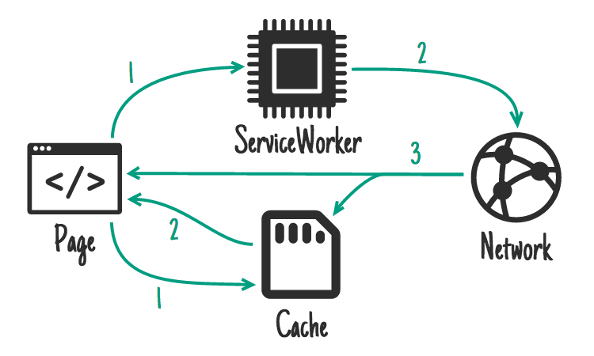

> **Ideal for:** Content that updates frequently. E.g. articles, social media timelines, game leaderboards.

**このパターンが適するのは：**頻繁に更新されるリソース（例：ブログ記事、ソーシャルメディアのタイムライン、ゲームのリーダーボード等）

> This requires the page to make two requests, one to the cache, one to the network. The idea is to show the cached data first, then update the page when/if the network data arrives.

このパターンではキャッシュとネットワークの両方のリクエストを同時に発行します。基本的なアイデアとしては、キャッシュから取得したリソースをまず表示して、もしネットワークからも取得できた場合は、後からそのリソースでページの内容を差し替えます。

> Sometimes you can just replace the current data when new data arrives (e.g. game leaderboard), but that can be disruptive with larger pieces of content. Basically, don't "disappear" something the user may be reading or interacting with.

ゲームのリーダーボードのような小さなリソースであれば、ページの内容を差し替えてもさほど影響はありませんが、大きいリソースの差し替えはユーザー体験を損ねる場合があります。原則としてユーザーが視聴中のコンテンツや入力途中のデータを消去することはやめましょう。

> Twitter adds the new content above the old content & adjusts the scroll position so the user is uninterrupted. This is possible because Twitter mostly retains a mostly-linear order to content. I copied this pattern for [trained-to-thrill](https://jakearchibald.github.io/trained-to-thrill/) to get content on screen as fast as possible, but still display up-to-date content once it arrives.

Twitterは古いコンテンツの上に新しいコンテンツを表示して、スクロール位置を調整するため、ユーザーがツイートを読んでいる最中に邪魔が入ることはありません。これは、Twitterのコンテンツはほとんどリニアなデータ構造で順番が管理されているからです。サンプルアプリケーションの[trained-to-thrill](https://jakearchibald.github.io/trained-to-thrill/)では、コンテンツの表示時間を短く、かつ最新のコンテンツを表示するために、このパターンを適用しています。

> **Code in the page:**

**Webページのコード**

```js
var networkDataReceived = false;

startSpinner();

// > fetch fresh data
// 最新のリソースをネットワークから取得する
var networkUpdate = fetch('/data.json').then(function(response) {
  return response.json();
}).then(function(data) {
  networkDataReceived = true;
  updatePage();
});

// > fetch cached data
// キャッシュからも取得する
caches.match('/data.json').then(function(response) {
  if (!response) throw Error("No data");
  return response.json();
}).then(function(data) {
  // > don't overwrite newer network data
  // ネットワークから取得済みの場合はページ更新しない
  if (!networkDataReceived) {
    updatePage(data);
  }
}).catch(function() {
  // > we didn't get cached data, the network is our last hope:
  // キャッシュから取得できなかった場合はネットワークからの取得に頼るしかない
  return networkUpdate;
}).catch(showErrorMessage).then(stopSpinner);
```

> **Code in the ServiceWorker:**

**Service Workerのコード**

> We always go to the network & update a cache as we go.

常にネットワークからリソースを取得して、キャッシュを更新しています。

```js
self.addEventListener('fetch', function(event) {
  event.respondWith(
    caches.open('mysite-dynamic').then(function(cache) {
      return fetch(event.request.clone()).then(function(response) {
        cache.put(event.request, response.clone());
        return response;
      });
    })
  );
});
```

> The above doesn't work in Chrome yet, as we've yet to expose fetch and caches to pages ([ticket #1](https://code.google.com/p/chromium/issues/detail?id=436770), [ticket #2](https://code.google.com/p/chromium/issues/detail?id=439389)).

`fetch`と`cache`はChromeでまだ実装されていないため、上記のコードは動きません。関連するチケットは、[ticket #1](https://code.google.com/p/chromium/issues/detail?id=436770)および[ticket #2](https://code.google.com/p/chromium/issues/detail?id=439389)です。（※訳注：[`fetch` API](http://updates.html5rocks.com/2015/03/introduction-to-fetch)は Chrome 42で実装されました。）

> In [trained-to-thrill](https://jakearchibald.github.io/trained-to-thrill/) I worked around this by using [XHR instead of fetch](https://github.com/jakearchibald/trained-to-thrill/blob/3291dd40923346e3cc9c83ae527004d502e0464f/www/static/js-unmin/utils.js#L3), and abusing the Accept header to tell the ServiceWorker where to get the result from ([page code](https://github.com/jakearchibald/trained-to-thrill/blob/3291dd40923346e3cc9c83ae527004d502e0464f/www/static/js-unmin/index.js#L70), [ServiceWorker code](https://github.com/jakearchibald/trained-to-thrill/blob/3291dd40923346e3cc9c83ae527004d502e0464f/www/static/js-unmin/sw/index.js#L61)).

サンプルアプリケーションの[trained-to-thrill](https://jakearchibald.github.io/trained-to-thrill/)では、`fetch API`を使う代わりに[XHRを使用しました](https://github.com/jakearchibald/trained-to-thrill/blob/3291dd40923346e3cc9c83ae527004d502e0464f/www/static/js-unmin/utils.js#L3)。そこでは、Service Workerにリソースの取得元を伝えるために`Accept`ヘッダーを利用したハックを行っています。（[Webページのコード](https://github.com/jakearchibald/trained-to-thrill/blob/3291dd40923346e3cc9c83ae527004d502e0464f/www/static/js-unmin/index.js#L70)、[Service Workerのコード](https://github.com/jakearchibald/trained-to-thrill/blob/3291dd40923346e3cc9c83ae527004d502e0464f/www/static/js-unmin/sw/index.js#L61)）

> ###Generic fallback

###<a name="generic-fallback"></a>パターン７：キャッシュからもネットワークからも取得できなかった場合にデフォルトコンテンツを表示する

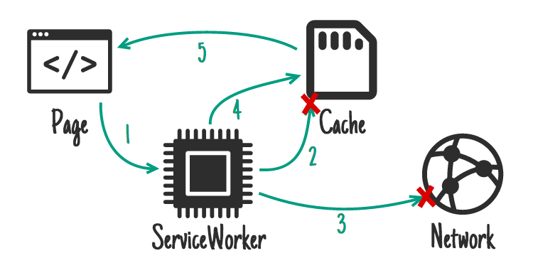

> If you fail to serve something from the cache and/or network you may want to provide a generic fallback.

キャッシュとネットワークの両方でリソースの取得に失敗した場合、あらかじめ用意したコンテンツを表示できるようにします。

> **Ideal for:** Secondary imagery such as avatars, failed POST requests, "Unavailable while offline" page.

**このパターンが適するのは：**アバターが取得できなかった場合のデフォルト画像、POSTリクエストが失敗したときに表示するコンテンツ、「このページはオフラインでは利用できません」といった内容を伝えるためのデフォルトページ等。

```js
self.addEventListener('fetch', function(event) {
  event.respondWith(
    // > Try the cache
    // まずはキャッシュから取得
    caches.match(event.request).then(function(response) {
      // > Fall back to network
      // なければネットワークから取得
      return response || fetch(event.request);
    }).catch(function() {
      // > If both fail, show a generic fallback:
      // 両方ダメな場合、デフォルトコンテンツを表示する
      return caches.match('/offline.html');
      // > However, in reality you'd have many different
      // > fallbacks, depending on URL & headers.
      // > Eg, a fallback silhouette image for avatars.
      // 実際にはURLやヘッダーの内容によって、
      // 多数の異なるコンテンツを提供する必要がある。
      // （例：シルエットのみのアバター等）
    })
  );
});
```

> The item you fallback to is likely to be an [install dependency](#on-install-as-a-dependency).

ちなみに、このパターンで使用するデフォルトコンテンツは[依存リソースとしてインストール](#on-install-as-a-dependency)されている必要があります。

> If your page is posting an email, your ServiceWorker may fall back to storing the email in an IDB 'outbox' & respond letting the page know that the send failed but the data was successfully retained.

もしメールのアプリケーションであれば、このような場合、Service WorkerはIndexedDBの送信ボックスにメールを保存します。そして、送信は失敗したもののメールのデータは送信ボックスに保存されている旨、ユーザーに知らせます。

> ###ServiceWorker-side templating

###<a name="serviceworker-side-templating"></a>パターン８：Service Workerサイド・テンプレート

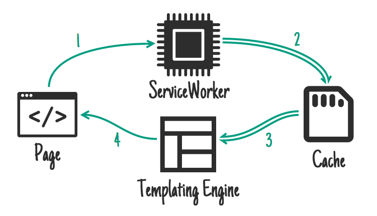

> **Ideal for:** Pages that cannot have their server response cached.

**このパターンが適するのは：**サーバーで動的に生成されたページ等、レスポンスをそのままキャッシュしてもあまり意味がないコンテンツ。

> [Rendering pages on the server makes things fast](http://jakearchibald.com/2013/progressive-enhancement-is-faster/), but that can mean including state data that may not make sense in a cache, e.g. "Logged in as…". If your page is controlled by a ServiceWorker, you may instead choose to request JSON data along with a template, and render that instead.

[サーバーサイドレンダリングにより、ページの初期表示は速くなります](http://jakearchibald.com/2013/progressive-enhancement-is-faster/)。しかしながら、「XXXとしてログインしています」のような、状態に依存したデータをキャッシュしてもあまり意味がありません。そこで、Service Workerを使います。ページをリクエストする代わりにテンプレートとJSONデータを取得し、Service Worker自身がレンダリングを行います。

```js
importScripts('templating-engine.js');

self.addEventListener('fetch', function(event) {
  var requestURL = new URL(event.request);

  event.respondWith(
    Promise.all([
      caches.match('/article-template.html').then(function(response) {
        return response.text();
      }),
      caches.match(requestURL.path + '.json').then(function(response) {
        return response.json();
      })
    ]).then(function(responses) {
      var template = responses[0];
      var data = responses[1];

      return new Response(renderTemplate(template, data), {
        headers: {
          'Content-Type': 'text/html'
        }
      });
    })
  );
});
```

>##Putting it together

##<a name="putting-it-together"></a>まとめ

> You don't have to pick one of these methods, you'll likely use many of them depending on request URL. For example, [trained-to-thrill](https://jakearchibald.github.io/trained-to-thrill/) uses:

ここで紹介したパターンのどれかひとつを選択しなければいけないわけではありません。おそらく、リクエストされたURLによって、これらのパターンのいくつかを使い分けることになると思います。例えばサンプルアプリケーションの[trained-to-thrill](https://jakearchibald.github.io/trained-to-thrill/)は以下のパターンを使用しています。

> * [Cache on install](#on-install-as-a-dependency), for the static UI and behaviour
> * [Cache on network response](#on-network-response), for the Flickr images and data
> * [Fetch from cache, falling back to network](#cache-falling-back-to-network), for most requests
> * [Fetch from cache, then network](#cache-then-network), for the Flickr search results

* 静的なアセットとスクリプト：[`install`イベント時に依存リソースをキャッシュに保存する](#on-install-as-a-dependency)
* Flickrの画像とデータ：[`fetch`イベント時にレスポンスをキャッシュに保存する](#on-network-response)
* その他ほとんどのリソース：[キャッシュになければネットワークから取得する](#cache-falling-back-to-network)
* Flickrの検索結果：[キャッシュから取得してさらにネットワークからも取得する](#cache-then-network)

> Just look at the request and decide what to do:

基本的に`fetch`イベントのハンドラで、以下のようにリクエストの内容を見て最適なパターンを適用します。

```js
self.addEventListener('fetch', function(event) {
  // > Parse the URL:
  // URLをパースする
  var requestURL = new URL(event.request.url);

  // > Handle requests to a particular host specifically
  // 特定のホストに対するリクエストを処理する
  if (requestURL.hostname == 'api.example.com') {
    event.respondWith(/* > some combination of patterns *//* パターンA */);
    return;
  }
  // > Routing for local URLs
  // 自ドメインURLのルーティング
  if (requestURL.origin == location.origin) {
    // > Handle article URLs
    // 記事のURLに対する処理
    if (/^\/article\//.test(requestURL.pathname)) {
      event.respondWith(/* > some other combination of patterns *//* パターンB */);
      return;
    }
    if (/\.webp$/.test(requestURL.pathname)) {
      event.respondWith(/* > some other combination of patterns *//* パターンC */);
      return;
    }
    if (request.method == 'POST') {
      event.respondWith(/* > some other combination of patterns *//* パターンD */);
      return;
    }
    if (/cheese/.test(requestURL.pathname)) {
      event.respondWith(
        new Response("Flagrant cheese error", {
          status: 512
        })
      );
      return;
    }
  }

  // > A sensible default pattern
  // デフォルトのパターン
  event.respondWith(
    caches.match(event.request).then(function(response) {
      return response || fetch(event.request);
    })
  );
});
```

> …you get the picture.

これで全体像はつかめたと思います。

> If you come up with additional patterns, throw them at me in the comments!

もし他のパターンを思いついたらぜひコメントで私に知らせてください。

>##Credits

##<a name=""></a>クレジット

> …for the lovely icons:

以下は本記事で使用したすばらしいアイコンの作者です。

* [Code](http://thenounproject.com/term/code/17547/) by buzzyrobot
* [Calendar](http://thenounproject.com/term/calendar/4672/) by Scott Lewis
* [Network](http://thenounproject.com/term/network/12676/) by Ben Rizzo
* [SD](http://thenounproject.com/term/sd-card/6185/) by Thomas Le Bas
* [CPU](http://thenounproject.com/term/cpu/72043/) by iconsmind.com
* [Trash](http://thenounproject.com/term/trash/20538/) by trasnik
* [Notification](http://thenounproject.com/term/notification/32514/) by [@daosme](http://thenounproject.com/flylion/)
* [Layout](http://thenounproject.com/term/layout/36872/) by Mister Pixel
* [Cloud](http://thenounproject.com/term/cloud/2788/) by P.J. Onori

> And thanks to [Jeff Posnick](https://twitter.com/jeffposnick) for catching many howling errors before I hit "publish".

そして最後に辛抱強く校正を手伝ってくれた[Jeff Posnick](https://twitter.com/jeffposnick)に感謝の意を述べたいと思います。

> ##Further reading

##<a name=""></a>参考文献

> * [Intro to ServiceWorkers](http://www.html5rocks.com/ja/tutorials/service-worker/introduction/)
> * [Is ServiceWorker ready?](https://jakearchibald.github.io/isserviceworkerready/) - track the implementation status across the main browsers
> * [JavaScript promises, there and back again](http://www.html5rocks.com/ja/tutorials/es6/promises/) - guide to promises

* [Service Worker の紹介](http://www.html5rocks.com/ja/tutorials/service-worker/introduction/)
* [Is ServiceWorker ready?](https://jakearchibald.github.io/isserviceworkerready/) - 主要なブラウザでの実装状況まとめ
* [JavaScript promises, there and back again](http://www.html5rocks.com/ja/tutorials/es6/promises/) - Promiseの紹介記事
